# Ascent Landing Page Design Document

## Overview

This document outlines the design for a beautiful, modern landing page for Ascent company. The landing page will leverage ReactBits animated UI components to create an engaging, memorable user experience that effectively communicates Ascent's brand and value proposition.

**Project Type**: Frontend Application - Landing Page
**Target Framework**: React/Next.js
**UI Library**: ReactBits (animated UI components)
**Design Philosophy**: Modern, animated, conversion-focused

## Technology Stack & Dependencies

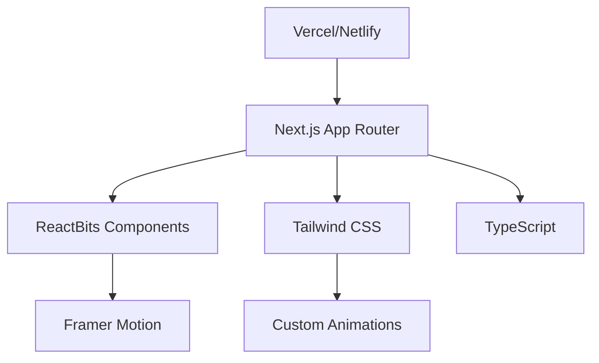

### Core Dependencies
- **Framework**: Next.js 15+ with App Router (matching your existing setup)
- **Package Manager**: pnpm (consistent with your chatbot project)
- **UI Components**: ReactBits animated component library
- **Base UI**: Radix UI primitives (consistent with your existing projects)
- **Styling**: Tailwind CSS v4+ (matching your todo-app setup)
- **Animations**: Built-in ReactBits animations + Framer Motion
- **Typography**: Inter font family
- **Icons**: Lucide React icons (consistent with your existing projects)
- **Performance**: Next.js Image optimization
- **Development**: TypeScript 5+ (matching your existing setup)

## Project Setup Instructions

### 1. Create Project Directory
```bash
# From your gemini workspace root
cd "C:\Users\FSOS\Desktop\Projects\gemini"
mkdir ascent-landing-page
cd ascent-landing-page
```

### 2. Initialize Next.js Project
```bash
# Initialize with TypeScript (matching your existing projects)
npx create-next-app@latest . --typescript --tailwind --eslint --app --src-dir=false
```

### 3. Install ReactBits and Dependencies
```bash
# Install ReactBits
pnpm add react-bits
# Note: If package name is different, check ReactBits documentation

# Install additional dependencies matching your existing setup
pnpm add @radix-ui/react-slot @radix-ui/react-label @radix-ui/react-dropdown-menu
pnpm add class-variance-authority clsx tailwind-merge
pnpm add lucide-react
pnpm add framer-motion
pnpm add next-themes

# Install dev dependencies
pnpm add -D @types/node @types/react @types/react-dom
```

### 4. Configure Package.json
```json
{
  "name": "ascent-landing-page",
  "version": "0.1.0",
  "private": true,
  "scripts": {
    "dev": "next dev",
    "build": "next build",
    "start": "next start",
    "lint": "next lint"
  }
}
```

### 5. Project Structure
```
ascent-landing-page/
├── app/
│   ├── globals.css
│   ├── layout.tsx
│   ├── page.tsx
│   └── favicon.ico
├── components/
│   ├── sections/
│   │   ├── hero-section.tsx
│   │   ├── features-section.tsx
│   │   ├── about-section.tsx
│   │   ├── testimonials-section.tsx
│   │   ├── cta-section.tsx
│   │   └── footer.tsx
│   ├── ui/
│   │   ├── animated-text.tsx
│   │   ├── animated-button.tsx
│   │   ├── feature-card.tsx
│   │   └── testimonial-card.tsx
│   └── layout/
│       ├── navigation.tsx
│       └── container.tsx
├── lib/
│   └── utils.ts
├── public/
│   └── images/
├── styles/
│   └── animations.css
├── package.json
├── tailwind.config.ts
├── tsconfig.json
└── next.config.ts
```

## Component Architecture

### Landing Page Structure

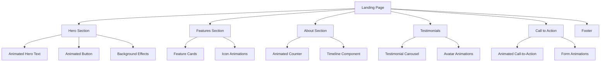

### Component Hierarchy

```
AscentLandingPage/
├── components/
│   ├── sections/
│   │   ├── HeroSection.tsx
│   │   ├── FeaturesSection.tsx
│   │   ├── AboutSection.tsx
│   │   ├── TestimonialsSection.tsx
│   │   ├── CTASection.tsx
│   │   └── Footer.tsx
│   ├── ui/ (ReactBits Components)
│   │   ├── AnimatedText.tsx
│   │   ├── AnimatedButton.tsx
│   │   ├── FeatureCard.tsx
│   │   ├── CounterAnimation.tsx
│   │   ├── TestimonialCarousel.tsx
│   │   └── ParticleBackground.tsx
│   └── layout/
│       ├── Navigation.tsx
│       └── Container.tsx
├── styles/
│   ├── globals.css
│   └── animations.css
└── page.tsx
```

### ReactBits Component Integration

| Section | ReactBits Components | Animation Type |
|---------|---------------------|----------------|
| Hero | Falling Text, Animated Container | Text reveal, fade-in |
| Features | Hover Cards, Icon Animations | Hover effects, scale |
| About | Number Counter, Progress Bars | Count-up, progress |
| Testimonials | Carousel, Avatar Bounce | Slide transitions |
| CTA | Button Animations, Form Focus | Pulse, focus states |
| Background | Particle System, Gradient | Continuous motion |

## Routing & Navigation

### Navigation Structure
- **Fixed Header**: Transparent background with blur effect on scroll
- **Smooth Scrolling**: Animated transitions between sections
- **Mobile Menu**: Hamburger menu with slide-in animation

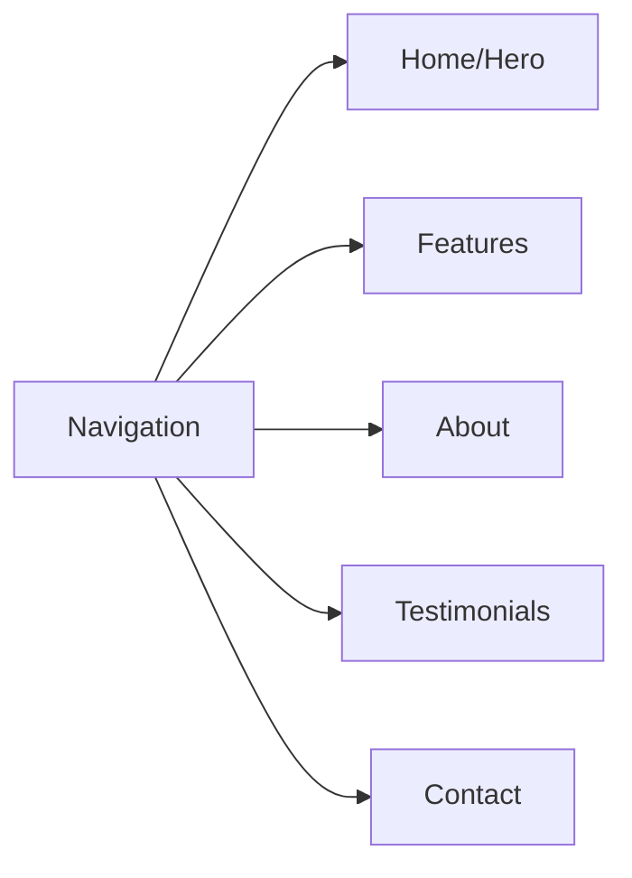

### URL Structure
- Primary Route: `/` (landing page)
- Anchor Links: `/#features`, `/#about`, `/#testimonials`, `/#contact`

## Styling Strategy

### Design System
- **Color Palette**: 
  - Primary: Deep Blue (#1e3a8a)
  - Secondary: Emerald (#10b981)
  - Accent: Amber (#f59e0b)
  - Neutral: Gray scale (#f8fafc to #0f172a)
- **Typography**: Inter font with weight variants (300, 400, 600, 700)
- **Spacing**: Tailwind's 4px base unit system
- **Breakpoints**: Mobile-first responsive design

### Animation Principles
- **Easing**: Custom easing functions for natural motion
- **Duration**: 300-800ms for UI interactions
- **Stagger**: Sequential animations for lists and cards
- **Reduced Motion**: Respect user preferences for accessibility

## Section-by-Section Design

### 1. Hero Section
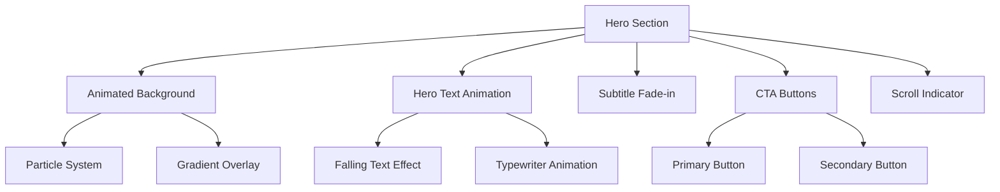

**Components Used**:
- ReactBits Falling Text for company name
- Animated Container for content reveal
- Custom particle background
- Animated buttons with hover effects

### 2. Features Section
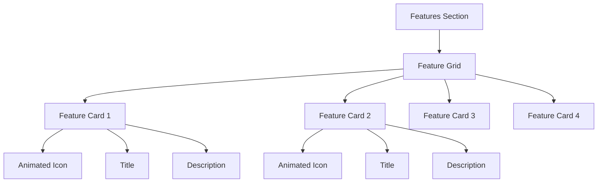

**Components Used**:
- ReactBits Hover Cards for feature highlights
- Icon animations on hover
- Staggered reveal animations

### 3. About Section
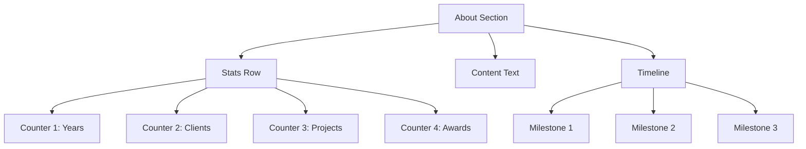

**Components Used**:
- ReactBits Number Counter for statistics
- Animated progress bars
- Timeline component with reveal animations

### 4. Testimonials Section
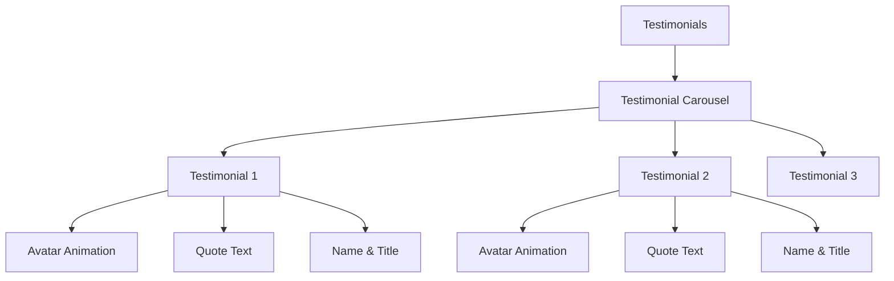

**Components Used**:
- ReactBits Carousel component
- Avatar bounce animations
- Fade transitions between testimonials

### 5. Call to Action Section
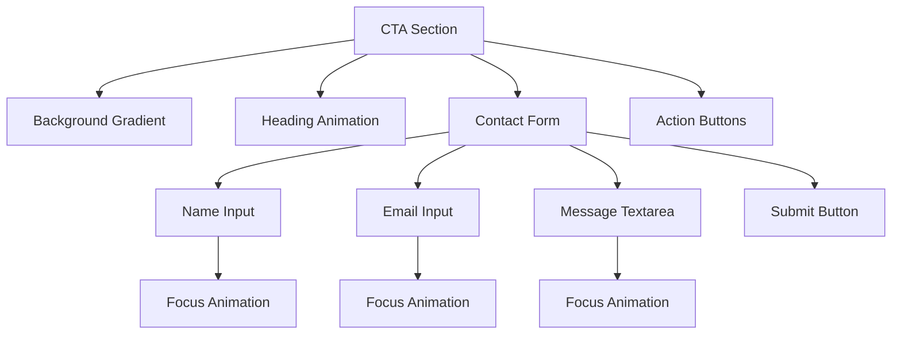

**Components Used**:
- ReactBits Form animations
- Input focus effects
- Button pulse animations
- Success/error state animations

### 6. Footer
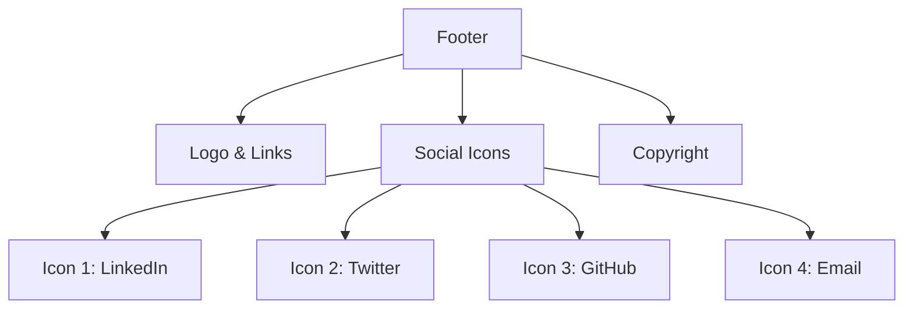

**Components Used**:
- Social icon hover animations
- Link hover effects
- Subtle background patterns

## State Management

### Component State Strategy
- **Local State**: React useState for component-specific state
- **Animation State**: ReactBits internal state management
- **Form State**: React Hook Form for contact form
- **Scroll State**: Intersection Observer for scroll-triggered animations

### State Flow
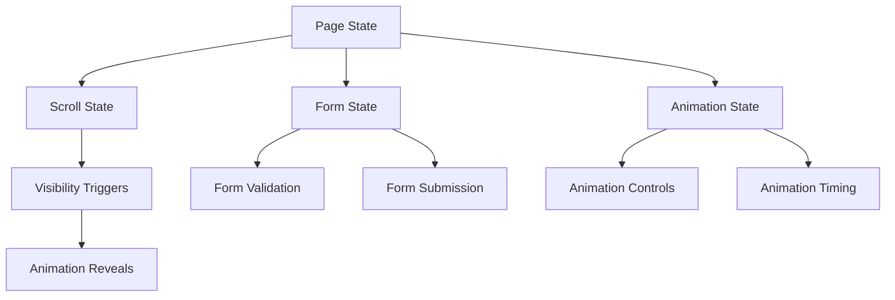

## Performance Considerations

### Optimization Strategy
- **Code Splitting**: Dynamic imports for ReactBits components
- **Image Optimization**: Next.js Image component with lazy loading
- **Animation Performance**: Hardware-accelerated CSS transforms
- **Bundle Size**: Tree-shaking unused ReactBits components
- **Critical CSS**: Inline critical styles for above-the-fold content

### Loading Strategy
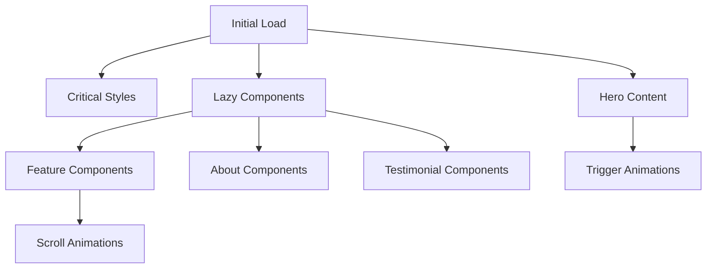

## Testing Strategy

### Testing Approach
- **Unit Tests**: Jest + React Testing Library for components
- **Animation Tests**: Test animation triggers and states
- **Integration Tests**: User interaction flows
- **Performance Tests**: Lighthouse scores and Core Web Vitals
- **Accessibility Tests**: Screen reader compatibility and keyboard navigation

### Test Coverage Areas
| Test Type | Components | Focus Area |
|-----------|------------|------------|
| Unit | Individual ReactBits components | Props, rendering, interactions |
| Integration | Section components | Animation sequences, data flow |
| E2E | Full page flow | User journey, form submission |
| Performance | Animation performance | Frame rates, loading times |
| Accessibility | All interactive elements | WCAG compliance, screen readers |

## Responsive Design

### Breakpoint Strategy
```css
/* Mobile First Approach */
sm: 640px   // Small tablets
md: 768px   // Tablets  
lg: 1024px  // Small laptops
xl: 1280px  // Desktops
2xl: 1536px // Large screens
```

### Component Responsiveness
- **Hero**: Stack content vertically on mobile, side-by-side on desktop
- **Features**: 1 column (mobile) → 2 columns (tablet) → 4 columns (desktop)
- **Testimonials**: Single testimonial (mobile) → carousel (desktop)
- **Navigation**: Hamburger menu (mobile) → horizontal nav (desktop)

## Accessibility Considerations

### WCAG 2.1 AA Compliance
- **Color Contrast**: Minimum 4.5:1 ratio for text
- **Keyboard Navigation**: All interactive elements accessible via keyboard
- **Screen Reader**: Semantic HTML and ARIA labels
- **Reduced Motion**: Respect prefers-reduced-motion setting
- **Focus Management**: Clear focus indicators and logical tab order

### Animation Accessibility
```css
@media (prefers-reduced-motion: reduce) {
  .animated-component {
    animation-duration: 0.01ms;
    animation-iteration-count: 1;
    transition-duration: 0.01ms;
  }
}
```